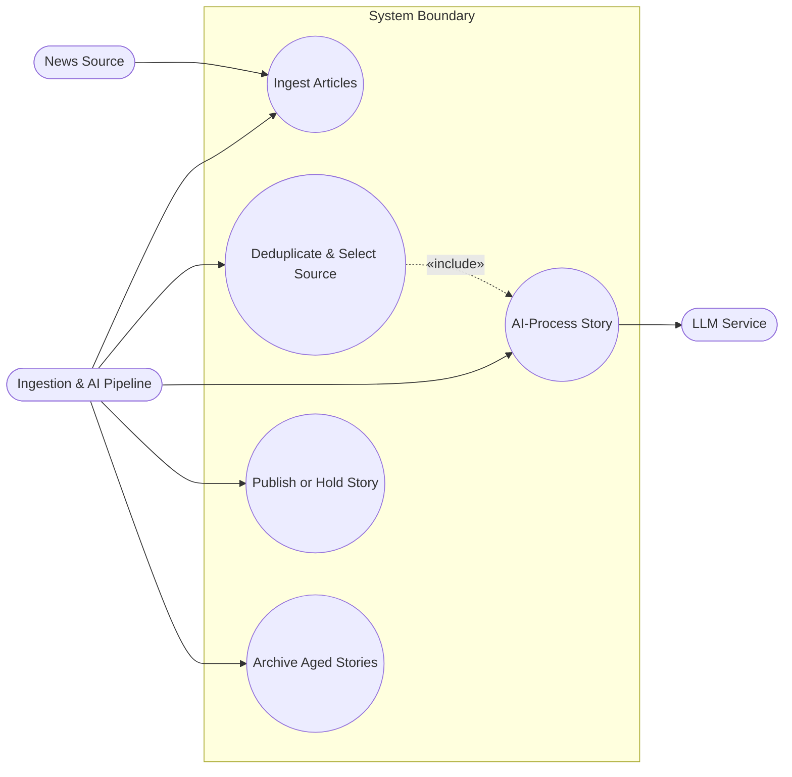
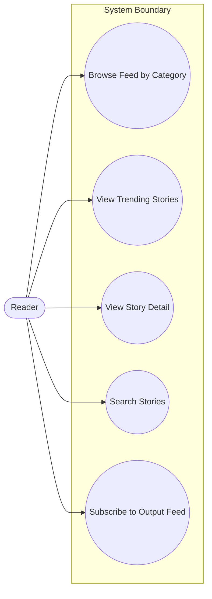
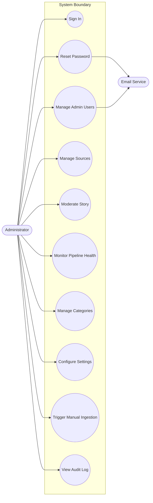

# Use Cases: AI News Aggregator

> Version: 1.0 · Status: Finalized · Last updated: 2026-06-29
> Derived from `srs.md` §3.1. Each use case traces to functional requirement IDs.

## Actors

| Actor | Type | Description |
| :--- | :--- | :--- |
| **Reader** | Human (primary) | Anonymous public visitor; browses, reads, searches. No account. |
| **Administrator** | Human (primary) | Internal staff; single Admin role with full back-office access. |
| **Ingestion & AI Pipeline** | System / time-triggered (primary) | Automated scheduled actor that fetches, deduplicates, processes, and publishes stories. |
| **News Source** | External system (supporting) | RSS/Atom feed or website providing free, public articles. |
| **LLM Service** | External system (supporting) | Performs translation, summarization, rewriting, classification, analysis. |
| **Email Service** | External system (supporting) | Delivers transactional admin emails. |

---

## Area 1 — Automated Ingestion & Processing Pipeline

### UC-001: Ingest articles from sources

- **ID:** UC-001
- **Actors:** Ingestion & AI Pipeline (primary), News Source (supporting)
- **Description:** On the scheduled interval, fetch new articles from all enabled sources.
- **Preconditions:** At least one enabled source is configured; the global interval has elapsed (or an admin triggered a run).
- **Postconditions (success):** New, non-duplicate raw articles are stored with metadata; an ingestion run record is written per source.
- **Traces to:** FR-INGEST-001..014, FR-SRC-004

**Main success scenario**
1. The pipeline starts a run for all enabled sources.
2. For each RSS/Atom source it fetches the feed; for feedless sources it scrapes article pages (honoring robots.txt and rate limits).
3. It extracts title, URL, publish date, author, body, language, and lead image.
4. It skips already-ingested articles (URL/content-hash match).
5. It detects language and flags non-English items for translation.
6. It stores qualifying new articles and records per-source counts (fetched/new/skipped/errored).

**Alternate flows**
- 2a. Source is disabled → excluded from the run.
- 3a. Article is paywalled/login-gated → skipped entirely (FR-INGEST-004).
- 3b. Full text cannot be extracted → skipped and logged (FR-INGEST-014).
- 2b. Item is below minimum length or a non-article page → discarded (FR-INGEST-012).

**Exception flows**
- 2c. Source fetch times out / returns an error → retried with backoff; failure recorded; run continues with other sources (FR-INGEST-008).
- *. Repeated source failures exceed threshold → in-app alert raised (FR-NOTIF-001).

### UC-002: Deduplicate and select a single source

- **ID:** UC-002
- **Actors:** Ingestion & AI Pipeline (primary), LLM Service (supporting, for translation)
- **Description:** Determine whether a new article reports a story already captured; keep one source and discard duplicates.
- **Preconditions:** New raw articles exist from UC-001.
- **Postconditions (success):** Each genuinely new story is represented by exactly one source's article; duplicates are discarded and coverage counts updated.
- **Traces to:** FR-DEDUP-001..009, FR-AI-001

**Main success scenario**
1. The pipeline translates non-English articles to English for comparison.
2. It compares each new article against existing stories within the recency window using semantic similarity.
3. If no match is found, the article becomes a new candidate story.
4. If a match is found against an already-published story, the new article is discarded and the story's coverage count is incremented.
5. Among multiple new candidates for the same story, it keeps one — preferring an English source, then the most complete article — and discards the rest (incrementing coverage count).

**Alternate flows**
- 2a. Similarity below threshold → treated as distinct stories.
- 2b. Articles fall outside the recency window → not treated as the same story.

**Exception flows**
- 1a. Translation fails → retried; if still failing, the article is held for the next run rather than mis-clustered (per FR-AI-011).

### UC-003: AI-process a story

- **ID:** UC-003
- **Actors:** Ingestion & AI Pipeline (primary), LLM Service (supporting)
- **Description:** Generate reader-facing AI content for a selected story and apply guardrails.
- **Preconditions:** A selected (deduplicated) candidate story exists.
- **Postconditions (success):** The story has a 2-line summary, one-paragraph rewrite, analysis, and a category; outputs passed guardrails or the story is flagged.
- **Traces to:** FR-AI-001..013

**Main success scenario**
1. The pipeline submits the (English) article to the LLM service.
2. It generates a 2-line summary, a one-paragraph original rewrite, a neutral analysis (commentary + sentiment & impact), and a category classification.
3. It enforces format/length and English-language constraints, regenerating on violation.
4. It verifies faithfulness to the source, regenerating or withholding on failure.
5. It records the model/version and prompt version with the outputs.

**Alternate flows**
- 2a. Story is foreign-language → already translated in UC-002; rewrite/analysis produced in English.
- *. AI-processing cap reached for the run → story deferred to a later run (FR-AI-013).

**Exception flows**
- 4a. Sensitive/unsafe content detected → story flagged and routed to moderation, not auto-published (FR-AI-009 → UC-015).
- 1a. AI service unavailable / transient error → retried with backoff; on ultimate failure the story is held in an error state and surfaced to monitoring (FR-AI-011, FR-NOTIF-002).

### UC-004: Publish or hold a story

- **ID:** UC-004
- **Actors:** Ingestion & AI Pipeline (primary)
- **Description:** Decide a processed story's fate: auto-publish if clean, otherwise hold for moderation.
- **Preconditions:** A story has completed AI processing.
- **Postconditions (success):** The story is Published (reader-visible) or Held-for-review.
- **Traces to:** FR-PUB-001..003, FR-PUB-010, FR-PUB-011

**Main success scenario**
1. The pipeline confirms all required AI outputs are present (FR-PUB-010).
2. If the story passed all guardrails, it transitions to Published with a published-at timestamp.
3. Published stories become visible in the reader feed, categories, trending, and search.

**Alternate flows**
- 2a. Story was guardrail-flagged → transitions to Held-for-review and enters the moderation queue (FR-PUB-003); an in-app indicator is raised (FR-NOTIF-003).

**Exception flows**
- 1a. A required AI output is missing → publication blocked; story held in error state.

### UC-005: Archive aged stories

- **ID:** UC-005
- **Actors:** Ingestion & AI Pipeline (primary)
- **Description:** Remove stories older than the retention window from the main feed while retaining them for search.
- **Preconditions:** Published stories exist older than the configured retention window.
- **Postconditions (success):** Aged stories are Archived — excluded from the feed, retained in storage and search.
- **Traces to:** FR-PUB-012, FR-SRCH-007

**Main success scenario**
1. On schedule, the system identifies published stories older than the retention window.
2. It transitions them to Archived.
3. Archived stories no longer appear in the main feed but remain searchable.

---

## Area 2 — Reader Experience

### UC-006: Browse the feed by category

- **ID:** UC-006
- **Actors:** Reader (primary)
- **Description:** A reader browses published stories, optionally filtered by category and sorted.
- **Preconditions:** Published stories exist.
- **Postconditions (success):** The reader sees a paginated list of published stories.
- **Traces to:** FR-READ-001, FR-READ-002, FR-READ-006, FR-READ-007, FR-READ-010

**Main success scenario**
1. The reader opens the home feed (newest-first).
2. The reader selects a category to filter, or a sort option (newest/trending).
3. The system displays a paginated list of matching published stories with headline, summary, sentiment badge, and lead image.

**Alternate flows**
- 2a. Category has no stories → empty-state message shown (FR-READ-007).

**Exception flows**
- 3a. Backend error loading the feed → error-state with retry shown.

### UC-007: View trending stories

- **ID:** UC-007
- **Actors:** Reader (primary)
- **Description:** A reader views stories ranked by how widely they are covered.
- **Preconditions:** Published stories with coverage counts exist.
- **Postconditions (success):** The reader sees stories ranked by coverage count.
- **Traces to:** FR-READ-003, FR-DEDUP-009

**Main success scenario**
1. The reader opens the trending / most-covered view.
2. The system ranks published stories by coverage count and displays them paginated.

### UC-008: View story detail

- **ID:** UC-008
- **Actors:** Reader (primary)
- **Description:** A reader opens a story to read the AI content and reach the original source.
- **Preconditions:** The story is Published or Archived.
- **Postconditions (success):** The reader sees the full AI content, attribution, and a link to the source.
- **Traces to:** FR-READ-004, FR-READ-005, FR-READ-009, FR-READ-012, FR-READ-013, FR-READ-014, FR-LEGAL-001, FR-LEGAL-003

**Main success scenario**
1. The reader selects a story.
2. The system shows the source headline, 2-line summary, one-paragraph rewrite, analysis (commentary + sentiment & impact), category, publish time, lead image, and sentiment badge.
3. AI-generated content is clearly labeled as such.
4. The system shows source attribution with a link to the original article and related stories from the same category.
5. The reader may share or copy the story link.

**Alternate flows**
- 1a. Story not found / unpublished → not-found page shown.

**Exception flows**
- 4a. Source link is dead → attribution still shown; outbound link may 404 on the source side (outside system control).

### UC-009: Search stories

- **ID:** UC-009
- **Actors:** Reader (primary)
- **Description:** A reader searches across published and archived stories.
- **Preconditions:** Indexed stories exist.
- **Postconditions (success):** The reader sees relevance-ranked, filterable results.
- **Traces to:** FR-SRCH-001..008

**Main success scenario**
1. The reader enters a keyword query.
2. The system returns relevance-ranked results across headline/summary/rewrite/analysis, with matched terms highlighted.
3. The reader filters by category/date and sorts by relevance or newest; results paginate.

**Alternate flows**
- 2a. No matches → empty-result guidance shown (FR-SRCH-006).

### UC-010: Subscribe to the output feed

- **ID:** UC-010
- **Actors:** Reader (primary)
- **Description:** A reader subscribes to an RSS/Atom feed of published stories.
- **Preconditions:** Published stories exist.
- **Postconditions (success):** The reader's feed client receives published-story entries (summary + link, no full source text).
- **Traces to:** FR-READ-015, EIR-COM-001, FR-LEGAL-002

**Main success scenario**
1. The reader adds the output feed URL to a feed client.
2. The system serves a standards-conformant feed of recent published stories (AI summary + link).

---

## Area 3 — Administration

### UC-011: Administrator signs in

- **ID:** UC-011
- **Actors:** Administrator (primary)
- **Description:** An administrator authenticates to the back-office.
- **Preconditions:** The admin has an active account.
- **Postconditions (success):** An authenticated admin session is established.
- **Traces to:** FR-AUTH-001, FR-AUTH-008, FR-AUTH-009, FR-AUTH-010, NFR-SEC-005

**Main success scenario**
1. The admin submits email and password.
2. The system verifies credentials and establishes a session (Secure/HttpOnly cookie).
3. The admin reaches the dashboard.

**Alternate flows**
- 2a. Account deactivated → access denied with a message.

**Exception flows**
- 1a. Repeated failed attempts → account locked after the threshold (FR-AUTH-009); login endpoint rate-limited (FR-AUTH-010).

### UC-012: Administrator resets password

- **ID:** UC-012
- **Actors:** Administrator (primary), Email Service (supporting)
- **Description:** An administrator recovers access via emailed reset link.
- **Preconditions:** The admin account exists.
- **Postconditions (success):** The password is changed; the old one no longer works.
- **Traces to:** FR-AUTH-005, FR-AUTH-007, FR-NOTIF-004

**Main success scenario**
1. The admin requests a password reset for their email.
2. The system sends a time-limited reset link via the email service.
3. The admin opens the link and sets a new password meeting the policy.
4. The system updates the credential and invalidates the link.

**Exception flows**
- 2a. Email service unavailable → the request is queued/retried; admin informed of possible delay.
- 3a. Link expired → admin must request a new one.

### UC-013: Manage admin users

- **ID:** UC-013
- **Actors:** Administrator (primary), Email Service (supporting)
- **Description:** Invite, list, and deactivate/reactivate administrators.
- **Preconditions:** The acting admin is authenticated.
- **Postconditions (success):** The admin user set is updated; invitations sent.
- **Traces to:** FR-AUTH-002, FR-AUTH-003, FR-AUTH-011, FR-ADMIN-006, FR-AUDIT-001

**Main success scenario**
1. The admin invites a new administrator by email.
2. The system emails an invitation; the invitee verifies email and sets a password to activate.
3. The admin may deactivate or reactivate existing administrators.
4. The action is recorded in the audit log.

**Alternate flows**
- 1a. Email already an admin → error shown.

**Exception flows**
- 2a. Invite link expired → admin re-invites.

### UC-014: Manage sources

- **ID:** UC-014
- **Actors:** Administrator (primary)
- **Description:** Add, validate, edit, enable/disable, soft-delete, and bulk-import sources.
- **Preconditions:** The admin is authenticated.
- **Postconditions (success):** The source configuration reflects the changes; attribution on past stories preserved.
- **Traces to:** FR-SRC-001..010, FR-AUDIT-001

**Main success scenario**
1. The admin adds a source (name, URL, type, default category, language).
2. The system validates by probing the feed/URL and shows a sample-fetch preview.
3. The admin saves; the source becomes available to the next ingestion run.
4. The admin can edit, enable/disable, or soft-delete sources, and view a source's ingestion history.

**Alternate flows**
- 1a. Bulk import → the admin uploads OPML/CSV; the system validates each row and reports per-row errors, importing valid rows (FR-SRC-010).
- 4a. Soft-delete → source removed from ingestion; existing stories retain attribution (FR-SRC-005).

**Exception flows**
- 2a. Validation probe fails (unreachable/invalid feed) → save blocked with a clear error.

### UC-015: Moderate a story

- **ID:** UC-015
- **Actors:** Administrator (primary)
- **Description:** Review held/flagged stories and approve, edit, reject, or unpublish.
- **Preconditions:** The admin is authenticated; stories exist in the queue or published set.
- **Postconditions (success):** The story's status and/or content reflects the admin's decision.
- **Traces to:** FR-PUB-003..009, FR-AI-012, FR-ADMIN-003, FR-AUDIT-001

**Main success scenario**
1. The admin opens the moderation queue and selects a held story (with its flag reason).
2. The admin edits the AI outputs if needed.
3. The admin approves the story → it transitions to Published.
4. The action and content change are recorded in the audit log.

**Alternate flows**
- 3a. The admin rejects the story with a reason → kept out of reader view (FR-PUB-006).
- *. The admin re-triggers AI processing for the story (FR-AI-012).
- *. The admin unpublishes a previously published story (FR-PUB-008).

### UC-016: Monitor pipeline health

- **ID:** UC-016
- **Actors:** Administrator (primary)
- **Description:** Review dashboards, ingestion/AI status, and operational alerts.
- **Preconditions:** The admin is authenticated.
- **Postconditions (success):** The admin has visibility into pipeline status and any failures.
- **Traces to:** FR-ADMIN-001, FR-ADMIN-002, FR-INGEST-009, FR-NOTIF-001..003, NFR-OBS-003

**Main success scenario**
1. The admin opens the dashboard (published today, queue size, ingestion health, errors).
2. The admin drills into per-source ingestion runs and the failed-AI-processing list.
3. In-app alerts highlight repeated source failures, AI failures, or new moderation items.

### UC-017: Manage categories

- **ID:** UC-017
- **Actors:** Administrator (primary)
- **Description:** Maintain the category taxonomy used by AI classification and reader browsing.
- **Preconditions:** The admin is authenticated.
- **Postconditions (success):** The taxonomy reflects the changes.
- **Traces to:** FR-ADMIN-004, FR-AUDIT-001

**Main success scenario**
1. The admin creates, renames, or enables/disables a category.
2. Disabled categories are hidden from readers but existing assignments are retained.
3. The change is audited.

### UC-018: Configure system settings

- **ID:** UC-018
- **Actors:** Administrator (primary)
- **Description:** View and update tunable settings without a deployment.
- **Preconditions:** The admin is authenticated.
- **Postconditions (success):** Updated settings take effect on the next run.
- **Traces to:** FR-ADMIN-005, NFR-MAINT-002, FR-AUDIT-001

**Main success scenario**
1. The admin opens system settings (interval, retention, similarity threshold, min length, AI cap, password policy, session timeout).
2. The admin updates a value and saves.
3. The system validates and applies it from the next run; the change is audited.

**Exception flows**
- 2a. Invalid value (out of range) → save blocked with a validation error.

### UC-019: Trigger manual ingestion

- **ID:** UC-019
- **Actors:** Administrator (primary)
- **Description:** Run ingestion on demand for all or one source.
- **Preconditions:** The admin is authenticated; at least one enabled source exists.
- **Postconditions (success):** An ingestion run executes outside the schedule.
- **Traces to:** FR-INGEST-011

**Main success scenario**
1. The admin triggers a manual run (all sources or a selected source).
2. The system executes the ingestion cycle (UC-001) and reports the outcome.

### UC-020: View audit log

- **ID:** UC-020
- **Actors:** Administrator (primary)
- **Description:** Review the immutable record of admin actions.
- **Preconditions:** The admin is authenticated; audit entries exist.
- **Postconditions (success):** The admin sees filtered audit entries.
- **Traces to:** FR-AUDIT-001..004

**Main success scenario**
1. The admin opens the audit log.
2. The admin filters/searches by actor, action, entity, or date range.
3. The system displays append-only entries with who/what/when and before/after where applicable.
